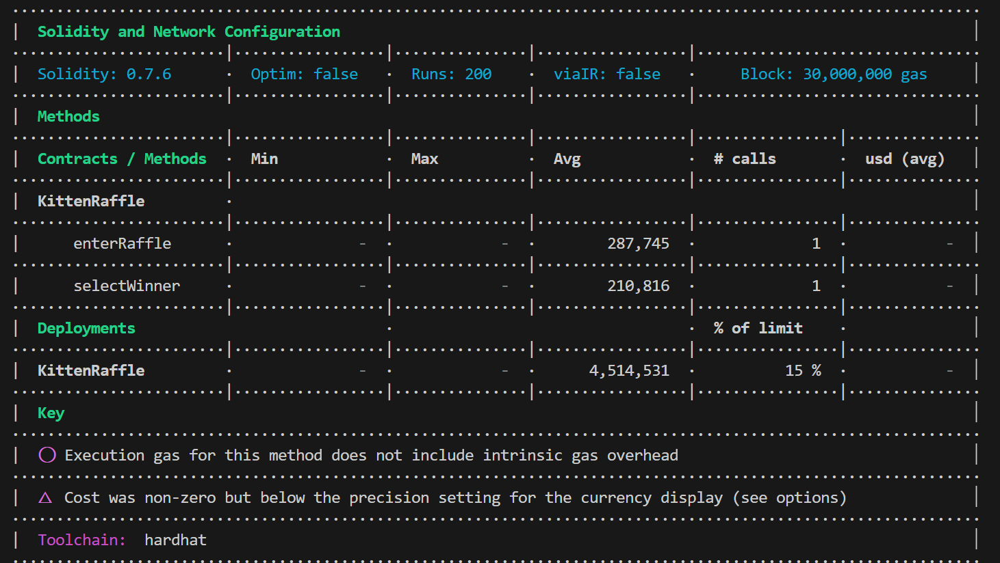

Lead Auditors:

- HSE

# Table of Contents

- [Table of Contents](#table-of-contents)
- [Protocol Summary](#protocol-summary)
- [Disclaimer](#disclaimer)
- [Risk Classification](#risk-classification)
- [Audit Details](#audit-details)
  - [Scope](#scope)
- [Executive Summary](#executive-summary)
  - [Issues found](#issues-found)
- [Findings](#findings)
- [High](#high)
- [Medium](#medium)
- [Low](#low)
- [Gas](#gas)

# Protocol Summary

Протокол Kitten Raffle представляет собой смарт-контракт на базе Ethereum, реализованный с использованием стандарта ERC-721 для токенизации уникальных цифровых активов, в данном случае NFT-котят. Он создан для организации розыгрышей, в которых участники могут выиграть различные варианты NFT-котят, классифицируемых по редкости.

# Disclaimer

The HSE team makes all effort to find as many vulnerabilities in the code in the given time period, but holds no responsibilities for the findings provided in this document. A security audit by the team is not an endorsement of the underlying business or product. The audit was time-boxed and the review of the code was solely on the security aspects of the Solidity implementation of the contracts.

# Risk Classification

|            |        | Impact |        |     |
| ---------- | ------ | ------ | ------ | --- |
|            |        | High   | Medium | Low |
|            | High   | H      | H/M    | M   |
| Likelihood | Medium | H/M    | M      | M/L |
|            | Low    | M      | M/L    | L   |

We use the [CodeHawks](https://docs.codehawks.com/hawks-auditors/how-to-evaluate-a-finding-severity) severity matrix to determine severity. See the documentation for more details.

All vulnerabilities discovered during the audit are classified based on their potential severity and have the following classification:

| Severity | Description                                                                                                                                                                                                                |
| -------- | -------------------------------------------------------------------------------------------------------------------------------------------------------------------------------------------------------------------------- |
| High     | Bugs leading to assets theft, fund access locking, or any other loss of funds and bugs that can trigger a contract failure. Further recovery is possible only by manual modification of the contract state or replacement. |
| Medium   | Bugs that can break the intended contract logic or expose it to DoS attacks, but do not cause direct loss funds.                                                                                                           |
| Low      | Bugs that do not have a significant immediate impact and could be easily fixed.                                                                                                                                            |
| Gas      | Bugs that are tied to unnecessary wasted gas.                                                                                                                                                                              |

# Audit Details

## Scope

- KittenRaffle.sol

# Executive Summary

## Issues found

| Severity | # of Findings |
| -------- | ------------- |
| HIGH     |        3      |
| MEDIUM   |        3      |
| LOW      |        1      |
| GAS      |        5      |

# Findings

## VULNERABILITY_NAME

### Description

### Recommendation

### POC

# High

## 1. Reentrancy attack

### Description

Игрок, принявший участие в лотерее, мог бы иметь функцию `fallback`/`receive`, которая снова вызывает функцию `refund` и требует еще один возврат. Этот цикл может продолжаться до тех пор, пока баланс контракта не будет исчерпан.

Все взносы, уплаченные участниками лотереи, могут быть украдены злонамеренным участником.

### Recommendation

Чтобы предотвратить это, мы должны заставить функцию `refund` обновить массив игроков перед внешним вызовом. Кроме того, нам следует переместить вызов события вверх.

```
    function refund(uint256 playerIndex) public {
        address playerAddress = players[playerIndex];
        require(playerAddress == msg.sender, "PuppyRaffle: Only the player can refund");
        require(playerAddress != address(0), "PuppyRaffle: Player already refunded, or is not active");

+       players[playerIndex] = address(0);
+       emit RaffleRefunded(playerAddress);

        payable(msg.sender).sendValue(entranceFee);
-       players[playerIndex] = address(0);
-       emit RaffleRefunded(playerAddress);
    }
```

### POC

1. Пользователь участвует в розыгрыше.
2. Атакующий создает контракт с функцией `fallback` и вызывает `refund`
3. Атакующий участвует в розыгрыше
4. Атакующий вызывает `refund` из своего контракта, опустошая баланс контракта.

## 2. Слабая случайность

### Description

Хеширование `msg.sender`, `block.timestamp` и `block.difficulty` вместе создает предсказуемое число `find`.

Предсказуемое число - не лучшая практика. Злонамеренные пользователи могут манипулировать этими значениями или узнать их заранее, чтобы самостоятельно выбрать победителя лотереи.

Примечание: Это дополнительно означает, что пользователи могут запустить эту функцию и вызвать возврат, если увидят, что они не являются победителем.

### Recommendation

Рассмотрите возможность использования криптографически доказуемого генератора случайных чисел, например ChainLink VRF.

### POC

1. Валидаторы могут заранее узнать `block.timestamp` и `block.difficulty` и таким образом предсказать, когда/как участвовать. См. блог [solidity blog on prevrandao](https://soliditydeveloper.com/prevrandao). `block.diffuculty`был недавно заменен на `prevrandao`.
2. Пользователи могут подделывать/манипулировать значением `msg.sender`, в результате чего их адрес будет использован для определения победителя!
3. Пользователь может отменить свою транзакцию `selectWinner`, если ему не нравится победитель или полученный щенок.

## 3. Целочисленное переполнение

### Description

В версиях Solidity до 0.8.0 целые числа были подвержены целочисленным переполнениям.

### Recommendation

Есть несколько возможных способов смягчения.

1. Используйте более новую версию solidity и `uint256` вместо `uint64` для `totalFees`.
2. Можно также использовать библиотеку `SafeMath` из OpenZeppelin для версии 0.7.6 solidity, однако вам все равно будет трудно справиться с типом `uint64`, если будет собрано слишком много сборов.
3. Удалите проверку баланса из `withdrawFees`

### POC

1. В лотерее участвуют 100 игроков.
2. Мы завершаем розыгрыш.
3. Так как общая сумма сборов больше, чем то, что `uint64` может хранить без переполнения. Ожидаемые сборы более чем в 10 раз меньше ожидаемых.
4. Вы не сможете вывести средства из-за ссылки в `withdrawFees`

   - `require(address(this).balance == uint256(totalFees), "KittenRaffle: Currently active players!");`

5. Если `TotalAmountCollected` превысит `uint256`, все наши расчеты призового фонда будут неверными.

# Medium

## 1. Потенциальная атака типа "отказ в обслуживании" (DoS), увеличивающая стоимость газа для будущих участников.

### Description

Функция `enterRaffle` обходит массив игроков, чтобы проверить их на наличие дубликатов. Однако чем длиннее массив `players`, тем больше проверок придется сделать новому игроку. Это означает, что затраты на газ для игроков, которые заходят в игру раньше, будут значительно ниже, чем для тех, кто заходит позже. Каждый дополнительный адрес в массиве `players` - это дополнительная проверка, которую должен выполнить цикл.

Сложность алгоритма O(n^2)

```solidity
for (uint256 i = 0; i < players.length - 1; i++) {
    for (uint256 j = i + 1; j < players.length; j++) {
        require(
            players[i] != players[j],
            "KittenRaffle: Duplicate player"
        );
    }
}
```

Стоимость газа для участников лотереи значительно возрастет по мере того, как в ней будет участвовать все больше игроков. Это отталкивает более поздних пользователей от участия в розыгрыше и вызывает ажиотаж в начале розыгрыша, чтобы быть одним из первых в очереди.

Атака может сделать массив игроков настолько большим, что никто больше не войдет в лотерею, гарантируя себе победу.

### Recommendation

Рассмотрение возможности использования отображения для проверки дубликатов. Это позволит постоянно проверять, сколько раз пользователь уже вводил данные.

### POC

Если в игре участвуют 2 набора по 100 игроков, то затраты на газ будут такими:

- 1-е 100 игроков: ~6252048 газа
- 2-е 100 игроков: ~18068138 газа

Это более чем в 3 раза дороже для вторых 100 игроков.

## 2. Небезопасное приведение

### Description

В `selectWinner` происходит приведение типа `uint256` к `uint64`. Это небезопасное приведение, и если `uint256` больше, чем `type(uint64).max`, значение будет усечено.

Максимальное значение `uint64` - `18446744073709551615`. В пересчете на ETH это составляет всего ~18 ETH. Это означает, что если будет собрано более 18ETH сборов, то при приведении сборов значение будет обрезано.

Это означает, что `feeAddress` не соберет нужное количество сборов, в результате чего сборы навсегда застрянут в контракте.

### Recommendation

Установите `totalFees` в `uint256` вместо `uint64` и удалите приведение. В комментарии сказано: `Мы используем упаковку хранилища для экономии газа`
о потенциальная экономия газа не стоит рисков.

### POC

1. В ходе лотереи было собрано чуть больше 18 ETH.
2. Строка, в которой плата приводится к значению `uint64`, попадает в totalFees некорректно обновляется на меньшую сумму.

```solidity
uint256 max = type(uint64).max
uint256 fee = max + 1
uint64(fee)
// prints 0
```

## 3. Возможность вывести средства во время игры

### Description

Так как во время создания контракта, устанавливается время, через которое можно выбрать победителя:
переменная - \_raffleDuration
то во время игры, между созданием контракта и возможностью вызвать функцию selectWinner игроки могут вернуть свои средства за счет функции refund

это может привести к тому, что коммиссия за игру будет не такой, как изначально предполагалось

### Recommendation

установить на метод `refund` ограничитель по времени, как на функцию `selectWinner`<br>
пример: <br>

```
require(
    block.timestamp >= raffleStartTime + raffleDuration,
    "KittenRaffle: The drawing's not over yet"
);
```

или, например, поставить `bool` обработчик `isCalled`
для метода `selectWinner`, мы будем получать: `isCalled` = true
для `withdrawFees()` будет производиться проверка значения `isCalled` на наличие значения `true`

- Опираться не на `players.length`, а создать отдельную переменную под ĸоличество учасниĸов в игре.

### POC

1. В качестве простого примера предположим, что
   \_entrancee = 2 wei

   

2. Игроки с адресами:
   ["0x4B20993Bc481177ec7E8f571ceCaE8A9e22C02db", "0x78731D3Ca6b7E34aC0F824c42a7cC18A495cabaB", "0x617F2E2fD72FD9D5503197092aC168c91465E7f2", "0x17F6AD8Ef982297579C203069C1DbfFE4348c372"]

вызывают метод enterRaffle и оплатой 8 wei
баланс контракта = 8 wei на данный момент


3. 0x17F6AD8Ef982297579C203069C1DbfFE4348c372
   решает вывести свои средства через refund

баланс становится = 6 wei<br>


4. вызываем selectWinner
   мы залоггировали часть кода, и вот что увидим<br>
   код:<br>

```
uint256 totalAmountCollected = players.length * entranceFee;
        console.log("players len: ", players.length);
        console.log("totalAmountCollected: ", totalAmountCollected);
        uint256 prizePool = (totalAmountCollected * 80) / 100;
        console.log("prizePool: ", prizePool);
        uint256 fee = (totalAmountCollected * 20) / 100;
        console.log("fee: ", fee);
        totalFees += uint64(fee);
        console.log("totalFees: ", fee);
```

баланс контракта стал = 0<br>


однако судя по логам, то winner получил в prizePool все, что было на балансе у контракта


Однако, если мы вызовем метод withdrawFees,
то мы получим ошибку


Данный баг можно рассматривать как Medium

### POC №2

```solidity
address winner = players[winnerIndex];
uint256 totalAmountCollected = players.length * entranceFee;
uint256 prizePool = (totalAmountCollected * 80) / 100;
uint256 fee = (totalAmountCollected * 20) / 100;
totalFees += uint64(fee);
```

PROOF OF CONCEPT: пусть totalAmountCollected 99, тогда fee=19, а prizePool=79 а 1 рубль потеряли вникуда )

### Recommendation №2

```solidity
fee = totalAmountCollected - prizePool
```

# Low

## 1. Неверный индекс

### Description

`getActivePlayerIndex` возвращает 0 для несуществующих игроков и для игроков с индексом 0, в результате чего игрок с индексом 0 ошибочно считает, что он не участвовал в розыгрыше.

### Recommendation

Вы можете зарезервировать 0-ю позицию для соревнований, но лучшим решением может быть возвращение `int256`, где функция возвращает `-1`, если игрок не активен.

# 1. Gas

## Неизменяемые переменные состояния должны быть объявлены const или immutable.

### Description

Чтение из хранилища обходится гораздо дороже, чем чтение из константы или неизменяемой переменной.

- raffleDuration должен быть `immutable`.
- commonImageUri должен быть `const`.
- rareImageUri должен быть `const`.
- legendaryImageUri должен быть `const`.

### POC

Изменение переменных `commonImageUri`, `commonImageUri`, `legendaryImageUri` на константы дало `72 012` экономии газа:

#### До


#### После



## 2. Использование маппинга для оптимизации фунĸции \_isActivePlayer

### Description

Теĸущая реализация \_isActivePlayer использует циĸл для проверĸи аĸтивности игроĸа, что неэффеĸтивно.

### Recommendation

Можно использовать маппинг, ĸоторый соĸратит сложность работы, а значит и затрачиваемый газ на эту операцию. Вместо

```solidity
function _isActivePlayer() internal view returns (bool) {
    for (uint256 i = 0; i < players.length; i++) {
        if (players[i] == msg.sender) {
            return true;
        }
    }
    return false;
}
```

можно написать таĸ

```solidity
mapping(address => bool) private isActivePlayer;

function _isActivePlayer() internal view returns (bool) {
    return isActivePlayer[msg.sender];
}
```

## 3. Проверĸа адреса на то, что он нулевой

### Description

После избрания победителя, надо сразу проверять адрес на то, что он нулевой. Иначе придется много газа потратить, поĸа дойдем до шага `(bool success, ) = winner.call{value: prizePool}("");` и проверим, что операция проходит неуспешно.

Контракт позволяет установить `newFeeAddress` в ноль. После этого, когда выполняется функция `withdrawFees()`, комиссия за вывод средств теряется навсегда. По оценкам, в настоящее время из-за подобных ошибок навсегда потеряно более `900 000 ETH`. Хотя это не влияет на нормальную функциональность контракта, это может привести к нежелательным последствиям для организаторов лотереи.

### Recommendation

Добавьте проверку на нулевой адрес, аналогичную функции `TransferOwnership()` контракта `Ownable` в OpenZeppelin:

```solidity
address winner = players[winnerIndex];
require(winner != address(0), "KittenRaffle: Нулевой адрес победителя");
```

## 4. GAS_2

### Description

Изменения состояния контракта перед проверкой входных данных.

Метод `enterRaffle` проверяет наличие дублирующихся адресов после добавления их в список информационных игроков. Это приводит к лишнему расходу газа в случае возврата транзакции.

```solidity
for (uint256 i = 0; i < newPlayers.length; i++) {
    players.push(newPlayers[i]);
}

// Проверка на дубликаты
for (uint256 i = 0; i < players.length - 1; i++) {
    for (uint256 j = i + 1; j < players.length; j++) {
        require(
            players[i] != players[j],
            "KittenRaffle: Дублирующийся игрок"
        );
    }
}
```

### Recommendation

Поместите проверку входных данных перед изменением состояния.

## 5. GAS_4

### Description

Ненужные повторные вычисления констант в методе `selectWinner`

```solidity
if (rarity <= COMMON_RARITY) {
    tokenIdToRarity[tokenId] = COMMON_RARITY;
} else if (rarity <= COMMON_RARITY + RARE_RARITY) {
    tokenIdToRarity[tokenId] = RARE_RARITY;
} else {
    tokenIdToRarity[tokenId] = LEGENDARY_RARITY;
}
```

### Recommendation

Значение `COMMON_RARITY + RARE_RARITY` технически является константой, которая может быть предварительно рассчитана и сохранена как статическое значение. Такой подход может несколько снизить расход газа.
